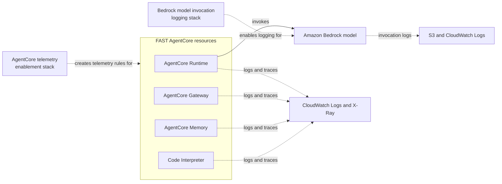

# Observability

This section explains how to add logging, tracing, and metrics to a FAST
deployment. FAST ships the agent, gateway, memory, and frontend infrastructure,
but it intentionally does **not** turn on account and region level telemetry for
you. Observability settings such as CloudWatch Transaction Search, telemetry
resource discovery, and Bedrock model invocation logging are one-time,
account/region scoped decisions that most teams want to own and control
separately from the application stack.

To keep those concerns cleanly separated, FAST points to two standalone,
CloudFormation based companion solutions that you deploy alongside your FAST
stack:

| Solution | What it enables | Guide |
|---|---|---|
| AgentCore telemetry enablement | CloudWatch logs and X-Ray traces for AgentCore Runtime, Gateway, Memory, Code Interpreter, Browser, and Workload Identity | [AgentCore Telemetry Enablement](AGENTCORE_TELEMETRY.md) |
| Bedrock model invocation logging | Model invocation logs (text, image, embedding, video) to S3 and CloudWatch Logs | [Bedrock Model Invocation Logging](BEDROCK_MODEL_INVOCATION_LOGGING.md) |

## How the two layers fit together

FAST's runtime behavior spans two AWS layers, and each layer has its own
observability solution:

- **AgentCore layer** - the managed Runtime, Gateway, Memory, and Code
  Interpreter primitives that host and orchestrate your agent. Telemetry for
  these resources is enabled with the
  [AgentCore telemetry enablement](AGENTCORE_TELEMETRY.md) solution. This gives
  you agent application logs, per-resource usage logs, and end-to-end traces in
  CloudWatch and X-Ray.
- **Bedrock model layer** - the foundation models your agent invokes for
  inference. Capturing the raw prompts, completions, and metadata for those
  invocations is handled separately by the
  [Bedrock model invocation logging](BEDROCK_MODEL_INVOCATION_LOGGING.md)
  solution.

Deploying both gives you a full picture: what the agent *did* (AgentCore
telemetry) and what the model *saw and returned* (Bedrock invocation logging).

## Prerequisites (account and region level)

The AgentCore telemetry solution depends on two one-time setup steps that are
**not** created by any CloudFormation stack. Enable them in each region where
you deploy FAST:

- **CloudWatch Transaction Search** - required for AgentCore trace delivery to
  X-Ray. Without it, trace deliveries fail.
  See [Enable Transaction Search](https://docs.aws.amazon.com/AmazonCloudWatch/latest/monitoring/Enable-TransactionSearch.html).
- **CloudWatch telemetry resource discovery** - lets CloudWatch discover your
  resources and their telemetry configuration.
  See [Setting up telemetry configuration](https://docs.aws.amazon.com/AmazonCloudWatch/latest/monitoring/telemetry-config-turn-on.html).

## Recommended order

1. Deploy your FAST stack (see the [Deployment Guide](DEPLOYMENT.md)).
2. Enable the account/region prerequisites above.
3. Deploy the [AgentCore telemetry enablement](AGENTCORE_TELEMETRY.md) stack in
   the same region as FAST.
4. Deploy the [Bedrock model invocation logging](BEDROCK_MODEL_INVOCATION_LOGGING.md)
   stack in the same region.

Because the telemetry rules apply to all current and future AgentCore resources
of each enabled type in the region, you can deploy the telemetry stack before or
after FAST and still capture telemetry for the FAST resources.

## A note on ownership

Both companion solutions are published as **proof-of-value** samples, not
production-ready implementations. Review them against the AWS Shared
Responsibility Model and your organization's requirements before using them in
production.
